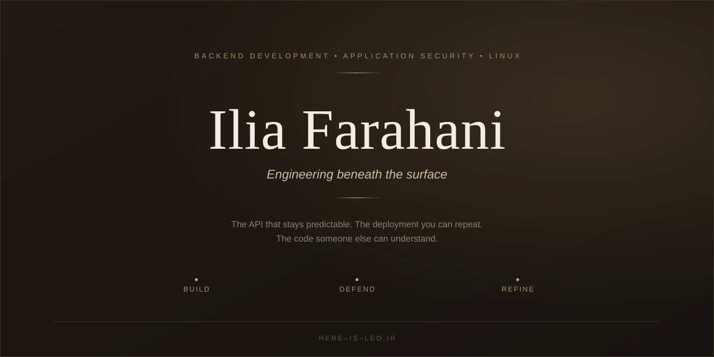
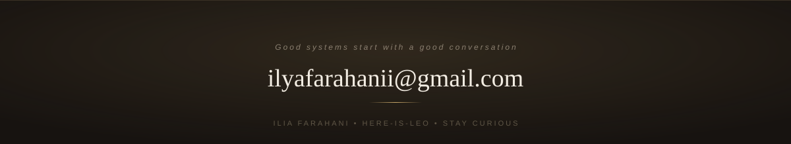

<div align="center">



<br/>

<a href="https://here-is-leo.ir/"></a>
<a href="https://www.linkedin.com/in/ilya-farahani"></a>
<a href="https://t.me/Here_is_leo"></a>
<a href="mailto:ilyafarahanii@gmail.com"></a>

<br/><br/>

**I care about what happens beneath the surface.**

The API that stays predictable. The authentication flow that holds up.
The deployment you can repeat. The code someone else can understand.

<sub>BACKEND DEVELOPMENT&nbsp;&nbsp;•&nbsp;&nbsp;APPLICATION SECURITY&nbsp;&nbsp;•&nbsp;&nbsp;LINUX & AUTOMATION</sub>

</div>

<br/>



I'm **Ilia Farahani**, a backend developer with a security-focused mindset.
I like understanding how things work — and what happens when their assumptions break.

```python
ilia = {
    "alias":    "here-is-leo",
    "home":     "Linux / terminal / editor",
    "focus":    ["Backend systems", "Application security"],
    "approach": "Understand → Build → Test → Refine",
}
```

<p align="center">
  
  
</p>
<p align="center">
  
</p>

<br/>



<div align="center">

| Layer | Technologies |
| :--- | :--- |
| 🐍 **Backend** | `Python` `C#` `.NET` `Node.js` `Express` `Django` `Flask` |
| 🎨 **Frontend** | `JavaScript` `React` `Next.js` `HTML` `CSS` `Tailwind CSS` |
| 🐧 **Infrastructure** | `Linux` `Kali Linux` `Bash` `Docker` `Nginx` `GitHub Actions` |
| 🗄️ **Data** | `SQLite` `Microsoft SQL Server` |
| 🛠️ **Workflow** | `Git` `GitHub` `VS Code` `Visual Studio` `Postman` |

</div>

<br/>



<table align="center">
<tr>
<td width="50%" valign="top">

**↗ Scalable APIs**
Services that stay understandable as they grow.

**↗ Application security**
Understanding attack paths to build better defenses.

</td>
<td width="50%" valign="top">

**↗ System design**
Turning requirements into deliberate architectural decisions.

**↗ Automation & CI/CD**
Making delivery repeatable, one workflow at a time.

</td>
</tr>
</table>

<br/>

<div align="center">
<sub>04 — SIGNAL FROM GITHUB</sub>
</div>
<br/>

<p align="center">
  
  
</p>

<p align="center">
  
</p>

<details>
<summary align="center"><b>↗&nbsp; Explore repositories & the daily contribution snake</b></summary>
<br/>

<div align="center">

[**Browse my repositories →**](https://github.com/here-is-leo?tab=repositories)

<picture>
  <source media="(prefers-color-scheme: dark)" srcset="https://raw.githubusercontent.com/here-is-leo/here-is-leo/output/github-contribution-grid-snake.svg" />
  
</picture>

<br/><br/>


</div>

</details>

<br/>

<details open>
<summary><b>⌘&nbsp; Open the developer terminal</b></summary>
<br/>

```console
ilia@linux:~$ cat mindset.txt

Read the source.
Question the assumptions.
Make the complex understandable.
Leave the system better than you found it.

ilia@linux:~$ ./next-idea
> Learn. Build. Improve. Repeat.
```

</details>

<br/><br/>

<a href="mailto:ilyafarahanii@gmail.com"></a>

<p align="center"><sub>ILIA FARAHANI&nbsp;&nbsp;•&nbsp;&nbsp;here-is-leo&nbsp;&nbsp;•&nbsp;&nbsp;STAY CURIOUS.</sub></p>
